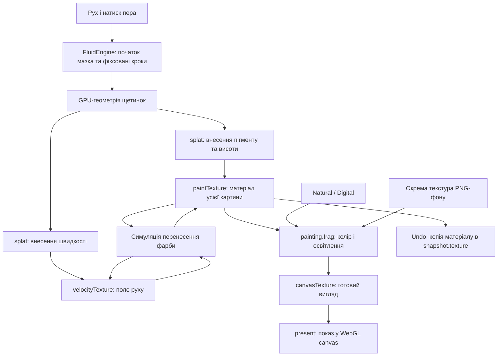

# Модель фарби, історія та інструменти Edit / Erase

Статус: технічний розбір поточної реалізації та проєкт рішень.
Дата: 2026-09-12. Runtime-код не змінено.

Документ розділяє підтверджені кодом механізми, висновки з них та пропозиції,
які ще потребують прототипу. Це основа для рішення, а не затверджений план
реалізації. Доповнює `ERASER-TOOL-REVIEW.md`; уточнює, чому простого
виправлення білого шейдера недостатньо для редагування окремих мазків.

## 1. Головна відповідь: що саме «запікається»

Твоя модель частково правильна: мазки справді поступово зливаються в растрові
дані. Але головний растр тут — **карта матеріалу**, а не готова кольорова
картинка canvas.

У кожній її клітинці зберігаються три параметри пігменту та висота фарби.
Окремий шейдер щоразу перетворює їх на видимий колір, додає освітлення та
фон. Тому вже намальоване можна показати в Natural або Digital без повторного
малювання мазків. Натомість інформація «цей пігмент належить мазку №17»
у карті матеріалу не зберігається.

Отже, є дві різні втрати інформації:

1. Під час малювання та симуляції втрачається незалежність окремих мазків:
   вони змішуються в одному полі матеріалу.
2. Під час рендерингу/PNG-експорту матеріал перетворюється на кінцеві кольори:
   у звичайному PNG вже немає висоти, параметрів пігменту та швидкості.

Natural/Digital працює між цими двома етапами. Undo зберігає дані до другого
етапу, але вже після першого.

## 2. Від pointer event до зображення



### 2.1 Шейдер не є мазком і не перетворюється на bitmap

Шейдер — програма, яку GPU виконує багато разів. Vertex shader готує
геометрію, fragment shader обчислює вихідні значення для фрагментів.
Куди ці значення потраплять, визначає налаштування draw call.

У `Simulator.splat()` до framebuffer приєднується `paintTexture`, після чого
GPU малює в неї. Framebuffer — об'єкт із налаштуванням цілі малювання;
самі довготривалі дані містяться у приєднаній texture.

JavaScript зберігає посилання на WebGL-об'єкт. Піксельні дані контролює GPU/
драйвер; на пристроях зі спільною пам'яттю це не обов'язково окрема фізична
відеопам'ять. Це не масив JS і не PNG-файл. Для читання на CPU потрібен
окремий readback, наприклад `readPixels()`.

### 2.2 Що записує один контакт щетинки

`splat.frag` повертає пігмент із кольору мазка та alpha, помножену на силу
контакту. Налаштування blend у `simulation.js` для фарби:

```text
blendFuncSeparate(SRC_ALPHA, ONE_MINUS_SRC_ALPHA, ONE, ONE)
```

Для одного фрагмента, якщо `a` — сила внесення фарби:

```text
pigment_new = pigment_stroke * a + pigment_old * (1 - a)
height_new  = height_old + a
```

Це важлива асиметрія: пігмент змішується, висота додається. Alpha текстури
фарби не є звичайною прозорістю фотографії; висота може перевищувати 1.
Усі щетинки та наступні мазки змінюють те саме поле.

Другий draw call записує швидкість у `velocityTexture`. Вона впливає на те,
куди потім переміститься фарба, зокрема фарба попередніх мазків.

### 2.3 Навіщо кілька проходів і дві paint-текстури

`Simulator.simulate()` обчислює divergence, pressure, коригує velocity,
потім виконує advection: за полем швидкості знаходить, звідки взяти матеріал
для поточної клітинки. `advect.frag` використовує RK2 і білінійну вибірку.

```text
крок n:     читаємо paintTexture A → записуємо paintTextureTemp B
swap:       B стає поточною paintTexture
крок n+1:   читаємо B → записуємо A
```

Swap міняє посилання; він не означає копію всіх даних. Дві текстури потрібні,
щоб прохід читав попередній стан та писав новий в іншу ціль. Це два робочі
буфери, а не два шари картини й не два останні мазки.

Splat натомість може змішувати свій вихід із destination через GPU blending,
не читаючи `paintTexture` як sampler у тому самому проході.

`splatAreas` — список областей і часу їхньої активності. Це не геометрія
мазків для редактора. Симуляція працює в об'єднаному прямокутнику активних
областей; область живе приблизно 60 кроків, поки нові контакти додають нові.
Після pointer-up симуляція ще може змінювати картину.

## 3. Які дані й де живуть зараз

| Об'єкт | Дані | Призначення | Містить окремі мазки? |
|---|---|---|---|
| `simulator.paintTexture` | RGBA float/half-float: 3 пігментні канали + висота | Поточний матеріал | Ні |
| `paintTextureTemp` | Такий самий формат | Робоча ціль симуляції | Ні |
| `velocityTexture` і Temp | Поле швидкості в RG, RGBA-сховище | Рух фарби | Ні |
| `pressureTexture`, Temp, `divergenceTexture` | Проміжні поля симуляції | Корекція швидкості | Ні |
| Текстури `Brush` | Позиції, швидкості, допоміжні дані щетинок | Поточний фізичний пензель | Не архів мазків |
| `renderer.backgroundTexture` | Окреме зображення | Сухий PNG-фон | Ні |
| `paint.canvasTexture` | Готовий екранний вигляд | Кеш рендерингу для показу | Ні |
| `snapshots[i].texture` | Повна копія матеріалу в момент запису | Undo/redo | Ні |
| `_stroke` у `FluidEngine` | Параметри активної операції | Виконання поточного мазка | Лише активний; після end очищається |

Не слід ототожнювати `canvasTexture` із `paintTexture`. Перша — результат
візуалізації, друга — джерело даних для наступного рендерингу та симуляції.

`paint.update()` за `needsRedraw` викликає `renderToTexture()`, а `present()`
показує кешовану картинку на default framebuffer canvas. UI-декорації
малюються окремо. Звичайне малювання не робить CPU-копію всього canvas щокадру.

## 4. Чому Natural / Digital змінює вже намальоване

Кнопки в `paint.js` змінюють `colorModel` і ставлять `needsRedraw = true`.
`PaintingRenderer._screenProgram()` вибирає варіант `painting.frag`.

Для тих самих `p = paintTexture.rgb`:

```text
Natural: visibleColor = trilinearPigmentCube(p)
Digital: visibleColor = 1 - p.yxz
```

Natural інтерполює між вісьмома кольорами пігментного куба. Digital застосовує
інше перетворення тих самих трьох чисел. Далі обидва варіанти враховують
нормаль, отриману з градієнта висоти, diffuse/specular і фон.

Перемикання моделі не запускає всю історію мазків і не переписує матеріал.
Воно змінює його відображення. Зокрема це не реконструкція RYB з готового RGB.
Назва Digital не означає, що стара фарба раптом стала окремою RGB-текстурою.

Відображення палітри також оновлюється; це допомагає вибирати наступний колір.
Історичні пігментні числа від цього не змінюються.

При PNG-фоні поточний renderer робить:

```text
result = mix(background, litPaint, clamp(height, 0, 1))
```

Тобто висота одночасно керує рельєфом і покриттям фону. Це наближення поточної
моделі, яке потрібно враховувати для ластика та майбутніх шарів.

## 5. Що насправді робить undo / redo

Перед початком малювання host викликає `saveSnapshot()`. Engine копіює
`paintTexture` у текстуру snapshot того самого типу/розміру й записує розміри
картини та `resolutionScale`.

Перед першим undo поточний результат додатково зберігається для redo.
Undo/redo пересуває індекс у кільці snapshot-ів і копіює вибраний матеріал
назад в обидві paint-текстури. `applyPaintTexture()` очищає обидві velocity-
текстури. Він не відновлює історичну швидкість; також сам не очищає `splatAreas`.
Для майбутнього транзакційного редактора це слід нормалізувати явно.

**Це перемикання між станами всієї картини, а не видалення об'єкта мазка.**
Історія також містить snapshots перед resize, тому навіть один її запис
не обов'язково відповідає одному мазку.

Snapshot не містить повного фізичного стану, журналу input events, фону або
поточного Natural/Digital. Відновлений матеріал рендериться з поточними
налаштуваннями показу. Тому «точний undo» тут означає відновлення збереженого
матеріалу, а не повернення всієї системи в минуле із тією самою траєкторією руху.

### Що запікається під час export

`renderToPixels()` запускає SAVE-варіант renderer в окрему byte-текстуру,
читає RGBA через `readPixels()`. Host кладе байти в 2D canvas і створює PNG.
Ось тут справді отримуємо звичайну готову bitmap-картинку. Вихідний alpha
у shader дорівнює 1. PNG не є форматом editable-документа цього engine.

## 6. Чому історія дорога

`HISTORY_SIZE = 15` у `paint-setup.js`; host створює 15 texture-snapshot-ів.
Коментар передбачає резерв одного стану для redo, тобто це не обіцянка 15
незалежних редагованих мазків.

Обсяг одного необтиснутого snapshot:

```text
simulationWidth × simulationHeight × 4 канали × bytesPerChannel
```

| Роздільність симуляції | Один RGBA32F | 15 RGBA32F | Один RGBA16F | 15 RGBA16F |
|---|---:|---:|---:|---:|
| 1024 × 1024 | 16 MiB | 240 MiB | 8 MiB | 120 MiB |
| 2048 × 2048 | 64 MiB | 960 MiB | 32 MiB | 480 MiB |

Це арифметика payload, не вимірювання конкретного пристрою. Додатково є
7 resolution-sized текстур симулятора, текстури щетинок, фон, presentation,
тимчасові ресурси та накладні витрати драйвера. Типи paint і simulation можуть
відрізнятися. `estimateRenderTargetBytes()` консервативно рахує по 16 байтів
на texel для 7 буферів плюс history; це не повний профайлер пам'яті застосунку.

Подвоєння ширини й висоти збільшує обсяг у 4 рази. Звичайний view zoom сам
по собі не означає збільшення resolution матеріалу.

Стиснути готовий PNG для undo — неправильна заміна: він втратить матеріал,
рельєф і можливість коректно змінювати Natural/Digital. Стискати можна саме
сирі матеріальні дані, із збереженням потрібної точності.

## 7. Гіпотеза: вилучати мазки з історії

### 7.1 Вилучити snapshot із поточного масиву — ні

Нехай A, B, C — мазки. Поточний матеріал:

```text
P1 = A(P0)
P2 = B(P1)
P3 = C(P2)
```

Видалення snapshot P2 не змінить P3. Відновлення P1 прибере і B, і C.
Для видалення лише B треба обчислити `C(A(P0))`, а цього стану в історії може
не бути. Крім того, оператори тут включають стан velocity та проходи часу.

### 7.2 Відняти різницю між snapshot-ами — загалом ні

Навіть без fluid, в одному пігментному каналі:

```text
Початок: 0
A: колір 1, a=0.5 → 0.5
B: колір 0, a=0.5 → 0.25
```

Якщо відняти внесок A, оцінений як `0.5 - 0`, від фінального `0.25`, отримаємо
`-0.25`. Правильний результат B без A — `0`. Внесок A вже змінений наступним
змішуванням. При `a=1` попередній пігмент взагалі перезаписується, тому
однозначної загальної інверсії немає.

Advection додає просторове змішування й округлення. «Мазок = різниця двох
текстур» придатне для переходу між сусідніми відомими станами, але не для
довільного віднімання цього мазка з будь-якого майбутнього стану.

### 7.3 Зберігати команди й переграти без вибраного мазка — так

Потрібен окремий **журнал операцій документа**, якого поточна ручна історія
не має. Для видалення B:

1. Знайти checkpoint перед B.
2. Відновити його.
3. Пропустити paint-контакти B, зберігши визначену політику часу.
4. Виконати всі наступні операції до кінця.
5. Замінити показаний стан після завершення перерахунку.

Результат означає «як виглядала б картина, якби цей мазок не було нанесено».
Наступні мазки можуть отримати інший вигляд: вони тепер змішуються з іншим
матеріалом і полем руху. Це очікувана семантика, а не помилка replay.

Початкова пропозиція щодо часу: при видаленні мазка зберігати його simulation
ticks як порожній інтервал, але не вносити його фарбу/velocity. Інакше
видалення також непомітно скоротить час висихання/руху між сусідніми мазками.
Потрібно окремо визначити відтворення стану пензля; новий мазок має власну
зафіксовану варіацію, незалежну від кількості попередніх випадкових викликів.

Tilecraft уже демонструє виконання команд через Stroke API, але не є записом
довільного ручного сеансу. Поточні `timing:'replay'` та `timing:'live'` мають
різні правила: просто подати live-полілінію в legacy replay недостатньо.

## 8. Що потрібно для надійного журналу

Пропонований запис, не чинний API:

```text
StrokeCommand:
  id, tool, enabled, transform
  pigmentChannels, alpha, brushSize, bristleCount, fluidity
  initialBrushVariation / deterministicSeed
  executedInputs[]             // фактично спожиті simulation inputs
  beginContact, finalContact   // контакти поза звичайними ticks
  tickRange, paintingGeometry, simulationResolution
  engineVersion, materialFormat

DocumentTimeline:
  paint / erase / resize / clear / simulation ticks / parameter changes
  background references, presentation settings

Checkpoint:
  timelinePosition, documentRevision, compatibleEngineConfiguration
  state sufficient to continue from this boundary
```

Лише `pointermove` координат недостатньо. Live engine працює з mailbox
останнього input, інтерполяцією, максимумом 5 кроків за `advance()` і
відкиданням надлишкового часу. Треба записувати фактично виконані inputs/
ticks та контакти, а не сподіватися повторити минулий RAF-розклад.

Engine уже має ін'єкцію `random`, однак `Brush.initialize()` споживає нову
випадкову варіацію на кожному початку. Глобальний seed сам по собі не вирішує
видалення B: зміна кількості random-викликів може змінити C. Потрібні стабільні
seed/variation на мазок і контроль початкової random-текстури щетинок.

Checkpoint під час руху має включати velocity, активні області та їхній вік,
лічильники, потрібний стан engine/пензля. Робочі scratch-буфери можна не
серіалізувати лише після доказу, що вони повністю відновлюються/перезаписуються
до читання. Поточний paint-only snapshot для цього недостатній.

Простіша межа — checkpoint у стані спокою між мазками: paint + метадані,
velocity нуль, активних областей немає, brush починається з визначеного стану.
Не можна назвати межу «сухою», просто дочекавшись pointer-up: фарба ще рухається.

Однакові команди не слід обіцяти як побітово однакову картину на різних GPU,
форматах float/half-float та версіях engine. Спочатку довести відтворюваність
на одному backend. Для переносимого документа зберігати також матеріальний
checkpoint і версію алгоритму; політику міграції визначити окремо.

## 9. Чи можна рухати мазок

**Так, але спершу треба визначити, що саме рухається.**

| Варіант | Що отримує користувач | Наслідки |
|---|---|---|
| Змінити координати команди й виконати її та майбутні команди знову | Мазок нанесений в іншому місці в той самий момент історії | Взаємодії та вигляд можуть змінитися |
| Перемістити незалежний шар/об'єкт | Збережений вигляд мазка переноситься як об'єкт | Потрібна нова модель шарів; fluid між об'єктами не зберігається автоматично |
| Вирізати область поточного матеріалу й перенести | Рухається весь вміст виділення | Це може включати частини багатьох мазків; приховану фарбу не відновить |

Для command-edit зберігати `transform` і перераховувати від checkpoint перед
зміненою командою. Під час drag можна показувати дешеве приблизне preview,
після release — справжній перерахунок. Старі checkpoints після зміни
невалідні для нової ревізії; їх не можна використати, щоб «перестрибнути»
залежні мазки. Перерахунок робити в окремому робочому стані, з можливістю
скасування й атомарним показом готового результату.

Для object-edit природний підхід — dry layers + один активний wet layer.
Мазок/група може мати material-текстуру, mask і transform. Natural/Digital
зберігається, якщо об'єкт зберігає матеріал, а не готову RGB-картинку.
Але композиція пігменту, висоти та coverage потребує нового контракту:
звичайне alpha-over поверх готових RGB не відтворює нинішнє мокре змішування.
Повна canvas-sized float-текстура на кожен мазок також погіршить пам'ять;
потрібні обрізані до bounds або sparse ресурси.

### Як вибирати мазок на canvas

Журнал дає ID та вихідну траєкторію. Її bounds/відстань до path можуть давати
кандидатів для вибору, але не точну власність видимого пікселя після fluid.
Колір у пікселі може бути сумішшю кількох мазків.

Для першого прототипу: список мазків/мініатюр + підсвічування вихідного path.
Hit-test на canvas — допоміжний вибір із кандидатів, а не обіцянка точно
визначити автора кожного змішаного пікселя. Один ID-buffer означав би лише
умовного власника, наприклад останній контакт, і не розв'язав би задачу
відокремлення фарби.

## 10. Як зробити undo дешевшим

Оптимізація undo та редагування мазків — окремі задачі. Можна покращити
першу без журналу, але це саме по собі не дасть видалення довільного мазка.

| Підхід | Пам'ять | Undo | Видалення старого мазка |
|---|---|---|---|
| Поточні повні snapshots | Висока, пропорційна площі × глибині | Пряме відновлення | Немає |
| Lazy snapshots + ліміт байтів | Менша до заповнення, контрольований максимум | Як зараз | Немає |
| Before/after tiles матеріалу | Пропорційна фактично зміненим tiles | Копіювання потрібних tiles | Немає без replay |
| Стиснені матеріальні snapshots на CPU | Менше GPU-пам'яті; RAM залежить від стискання | Readback/upload/декомпресія додають затримку | Немає без replay |
| Команди + рідкі checkpoints | Компактні команди, дорогі checkpoints | Може вимагати replay | Є, з перерахунком |
| Команди + checkpoints + кеш недавніх tiles | Керований компроміс | Швидко для недавніх операцій | Є, з перерахунком |

### 10.1 Найменша зміна

Ліниво створювати snapshots, обмежувати історію байтами, а не лише кількістю.
Це прибирає резерв усіх 15 повних текстур одразу, але не змінює вартість
кожного заповненого snapshot. Не знижувати precision матеріалу потайки.

### 10.2 Tiles для локальних змін

Розбити матеріал, наприклад, на tiles 128 × 128. Один RGBA32F tile — 256 KiB.
Для undo зберігати стан tile перед першою зміною в транзакції; для redo —
після останньої, або еквівалентну оборотну схему обміну.

Якщо змінилися 4 tiles, before+after займає 2 MiB замість 64 MiB одного
повного 2048² snapshot. Це приклад, не прогноз типового виграшу.

Критичне правило: dirty-region включає **всі записи симуляції**, а не тільки
слід курсора. Давня мокра фарба може рухатися далеко від нового мазка;
поточна симуляція використовує об'єднаний прямокутник. Before tile треба
зберегти до першого запису в нього, а не після виявлення зміни. Idle-ticks
також повинні належати визначеній транзакції або окремому запису часу.

Пропозиція для растрового undo: операція охоплює gesture і подальші idle-
зміни до наступної команди або стану спокою. Перед наступною командою
зафіксувати after попередньої. Undo під час руху спершу завершує поточну
транзакцію й зупиняє динаміку згідно з явним контрактом.

При великій зміні tiles можуть коштувати дорожче за full snapshot через
before/after та метадані. Потрібне адаптивне перемикання на full snapshot.
Resize/quality change доцільно спочатку обробляти повними станами.

### 10.3 Команди та checkpoints

Для масштабу: 600 samples по 5 float32 — 12 000 байтів без метаданих; це
приблизно 10 секунд input при 60 samples/s. У JS-об'єктах буде більше;
реальний журнал також міститиме ticks, параметри та службові записи.
Проте input зазвичай компактніший за full float-картинку.

Checkpoint-інтервал обирати за часом replay і бюджетом пам'яті, а не довільним
«кожні 10 мазків»: довгий мазок може коштувати більше за багато коротких.
Старі checkpoints можна вивантажувати й lossless-стискати на CPU/диску,
вимірявши затримки GPU readback. Не виконувати повний readback у кожному
pointermove. XOR байтових блоків є можливою оборотною delta-схемою, але
звичайне float-віднімання/додавання не гарантує побітового відновлення.

Журнал документа має жити довше за короткий undo-кеш. Видалення старого
snapshot із кешу не повинно видаляти команду, якщо вона ще редагована.
Якщо користувач погоджується на flatten старої частини, її команди можна
замінити базовим material-checkpoint, але ці мазки стануть нероздільними.

## 11. Варіанти Erase та їхній точний зміст

| Інструмент | Дія | Перевага | Обмеження |
|---|---|---|---|
| Біле покриття зі старого spec | Додає/показує білий матеріал | Закриває також PNG | Біла латка; не вилучає мазок |
| Material eraser | Зменшує пігмент і висоту до нуля | Локальне очищення; відкриває фон | Стирає суміш усіх мазків у зоні |
| History brush | Локально відновлює вибраний snapshot | Повертає старий матеріал | У зоні прибирає також усі пізніші зміни |
| Delete stroke | Вимикає команду й виконує залежний хвіст знову | Вилучає конкретну дію | Може змінити наступні змішування; replay коштує час |
| Object eraser | Прибирає незалежний шар/об'єкт | Чіткий вибір і швидке видалення | Потрібна інша структура документа |

Material eraser із попереднього review залишається найменшою зміною:
`material = gestureBaseline * (1 - maxGestureCoverage)`. Це не відновлення
фарби, яка була під стертою сумішшю; він відкриває сухий фон. Повне очищення
дає нуль усіх 4 каналів, feather — частковий матеріал. Можливі зміни відтінку
й rim на feather через поточний renderer ще треба оцінити візуально.

History brush, навпаки, може відкрити стару фарбу, але бере її зі snapshot,
а не «витягає» зі змішаних даних. Різниця має бути зрозуміла в UI.

Політика fluid для растрових edit-операцій потребує рішення: глобальне
заморожування дає передбачуване очищення, а збереження руху допускає
повторне затікання фарби. Вічна заборона затікання потребує окремих фізичних
меж/масок і правил нового малювання. Це не виправляється лише білим кольором.

## 12. Рекомендована архітектурна розвилка

**Якщо пріоритет — поточне fluid-малювання з можливістю прибрати/перенести
конкретний мазок: журнал команд + material-checkpoints + кеш undo.**
Растровий ластик залишається окремою операцією цього журналу.

Пропонований поділ відповідальності:

- `DocumentTimeline`: стабільні ID, команди, час, версії документа, порядок.
- `HistoryManager`: undo/redo змін документа, бюджет кешу та checkpoints.
- `ReplayController`: відновлення, виконання ticks, скасування застарілих jobs.
- `FluidEngine`: виконання й рендеринг; API запису виконаних inputs та
  checkpoint потрібного рівня, без знання UI-історії.
- `SelectionController`: вибір команди, path preview, transform preview.

Undo видалення мазка повертає enabled/команду в попередній стан документа;
кеш може прискорити показ, але не є джерелом істини про існування мазка.
Наступні spatial erase-команди за замовчуванням залишаються у world-
координатах: переміщення старого мазка не пересуває автоматично майбутній
ластик. Прив'язка ластика до об'єкта була б окремою функцією.

**Якщо пріоритет — рухати мазки зі збереженням їхнього вигляду як наклейки:**
потрібні незалежні material-об'єкти/шари та перегляд fluid-взаємодії.
Не варто обіцяти цей результат поверх єдиної змішаної `paintTexture`.

Для вже існуючої картини без журналу точне відновлення початкових мазків
неможливе із наявних даних. Її можна прийняти як базовий матеріальний стан
і зробити редагованими нові мазки. Для імпортованого PNG доступна лише
картинка, а не оригінальний матеріал.

## 13. Прототипи й критерії прийняття рішення

Порядок дозволяє перевірити найдорожчі припущення до повного UI.

1. **Довести розділення матеріалу й показу.** На зупиненій симуляції прочитати
   `readPaintTexture()`, перемкнути Natural/Digital, прочитати знову. Матеріал
   має збігтися, екранні кольори — змінитися. Перевірити також undo під іншою
   моделлю. Рух треба зупинити, інакше порівнюватимемо різні моменти симуляції.
2. **Записати й відтворити live-сеанс на одному backend.** Включити tap,
   pressure, довгий sweep, idle, фінальний контакт, dropped ticks і різні
   brush-параметри. Порівняти матеріал на контрольних ticks. Якщо replay не
   відтворює базовий сеанс, функцію Delete stroke ще не будувати.
3. **Перевірити A/B/C.** Записати три перехресні мокрі мазки, вимкнути B,
   зіставити з контрольним сеансом A/C за тією самою політикою часу і seeds.
   Має збігатися з A/C, а не з арифметичним відніманням B від A/B/C.
4. **Перемістити B.** Перерахувати B та хвіст. Окремо оцінити, чи прийнятна
   зміна вигляду C. Це головний UX-тест вибору command-edit проти object-edit.
5. **Профілювати історію.** Порівняти full snapshots, tiles і checkpoints на
   малих/великих мазках, кількох активних мокрих областях і resize. Записати
   peak GPU/CPU memory, p50/p95 undo та replay latency, readback stalls.
6. **Порівняти стирання.** Material erase, history brush і delete-command на
   тих самих темних/товстих мазках та PNG-фоні. Перевірити repaint, export,
   idle після erasing і undo/redo. Білий варіант лишити як контрольний зразок.

Орієнтири для обговорення, не результати вимірювань: кешований undo p95 до
100 ms на обраному тестовому пристрої; preview під час drag без повного replay;
для довгого replay — progress і cancel. Конкретний ліміт пам'яті визначати
разом із simulation budget після профілювання mobile та desktop.

### Рішення, які має зафіксувати наступний implementation spec

| Питання | Початкова рекомендація |
|---|---|
| «Стерти» означає біле покриття чи прибрати фарбу? | Прибрати матеріал, відкрити фон |
| Видалення старого мазка може змінювати наступні? | Так для command-edit; явно показати це в прототипі |
| Переміщення має зберігати старий вигляд? | Не обіцяти для command-edit; якщо необхідно — обрати layers |
| Що з wet motion при растровому erase? | Почати прототип із явного freeze, оцінити UX |
| Чи можна редагувати всі мазки безмежно? | Лише доки збережені команди й сумісний replay; flatten — явна операція |
| Яка точність undo? | Точний збережений матеріал; фізичне продовження — окремий контракт |

## 14. Bake to background: зафіксувати вигляд і малювати далі

Статус: перша незворотна версія реалізована. Вкладка `Bake` міститься в
extended panel; дія скидає звичайну та Story baseline-історію. GPU-only
оптимізація та редаговані шари не входять у цю версію.

Дія **«Запекти у фон»**
перетворює поточну композицію на звичайну кольорову bitmap у пам'яті,
встановлює її як суху основу й очищає активний матеріал.

```text
До:    старий фон + поточний матеріал → видима картина
Bake:  видима картина → новий bitmap-фон; матеріал = 0; рух = 0
Після: новий bitmap-фон + нова фарба → наступний етап малювання
```

Це практичне спрощення для поетапного малювання. Складна попередня картина
стає незмінною основою, нові мазки можна стерти material eraser-ом, відкривши
точно цю основу. Повторний Bake об'єднує основу та нову фарбу ще раз.
Журнал усіх мазків для такої функції не потрібен.

### 14.1 Що запікається і що залишається доступним

Запікаються поточна Natural/Digital-інтерпретація, освітлення, видимий
рельєф і попередній фон. Висота залишається лише намальованими тінями та
відблисками, а не фізичною поверхнею для нової фарби.

- Перемикання Natural/Digital надалі впливає лише на новий матеріал.
- Зміна освітлення не переосвітлює запечені мазки.
- Material eraser стирає нову фарбу, але не bitmap-основу.
- Delete/Move stroke для запечених мазків недоступні без окремо збережених
  команд/шарів. Bake не відновлює їхню незалежність.
- Стирання самої bitmap-основи було б іншим інструментом із власними правилами
  фону та прозорості; воно не випливає автоматично з цієї функції.

Це свідоме завершення етапу роботи. Назва «Висушити» була б неточною, якщо
очікується, що суха фарба все ще зберігає фізичний матеріал і реагує на модель
кольору. Для простого зупинення руху існує інша можлива дія — Freeze material.

### 14.2 Реалізація через наявні API

Перший прототип може повторити save без створення PNG/data URL:

1. Завершити активний gesture і передати canvas від Story ручному режиму.
   Зафіксувати поточний стан; не програвати додаткові settling frames.
2. Викликати `exportPixels()` у розмірі картини з поточним `colorModel`.
   Це рендерить матеріал разом із попереднім фоном, без курсора та UI.
3. Створити окремий 2D canvas у пам'яті, покласти байти в `ImageData` та
   викликати `putImageData()`, як уже робить export у `paint.js`.
4. Встановити цей canvas через `setBackgroundImage()`.
5. Очистити обидві paint- та velocity-текстури, `splatAreas` і стан активної
   операції; скинути live clock, позначити presentation як dirty.

Поточний `engine.clear()` виконує лише частину кроку 5: очищає дві paint-
текстури. Його недостатньо для повного завершення мокрого етапу.

Порядок має бути транзакційним: спочатку отримати й перевірити нову основу,
потім замінити стан. При помилці не втрачати старий матеріал чи фон. Для
надійної реалізації готувати нову background-текстуру окремо та міняти
посилання після успіху; нинішній setter перезаписує одну існуючу текстуру.

Розмір Bake — координати/розмір документа, не видимий zoomed viewport.
Перевірити Y-орієнтацію на асиметричному зразку: SAVE shader і background
upload мають свої правила перевороту. Не додавати переворот навмання.

Після прототипу можна прибрати CPU readback: renderer малює прямо в нову
RGBA8 background-текстуру в GPU. Це новий render-to-background шлях із
правильною орієнтацією та межами документа, а не просте призначення
`canvasTexture` фоном. `canvasTexture` залежить від екранної презентації.
Старий фон читається, новий є окремою ціллю запису; після проходу — swap.

### 14.3 Undo та пам'ять

Реалізований Bake є межею історії, а не її новим записом. Поточні paint-only
snapshots не можуть коректно перейти через цю межу: відновлення старої фарби
поверх уже запеченого фону подвоїло б її видимий внесок. Тому history indices
скидаються лише після успішного
commit; старі snapshot-текстури залишаються виділеними та перевикористовуються
для нової історії, але через Undo недоступні.

Для можливої reversible Bake потрібні before/after стани, що посилаються на відповідні
версії фону та матеріалу. Фони мають бути незмінними ресурсами з обліком
посилань, щоб звичайні snapshots не копіювали bitmap щоразу. Undo повертає
старий фон і старий матеріал, redo — новий фон і порожній матеріал.
Повернення матеріалу може залишатися з нульовим рухом, як у поточному undo;
не обіцяти відновлення історичної фізичної траєкторії.

Одна RGBA8-основа 2048² має payload 16 MiB, проти 64 MiB RGBA32F-матеріалу.
Але **Bake не звільняє 15 snapshot-текстур чи буфери симулятора**: це
фіксований пул, потрібний для нової історії після Bake. Стара інформація в
ньому стає недоступною й поступово перезаписується. Окремий майбутній lazy-
history manager міг би звільняти або створювати такі ресурси за потребою.

Також не слід змішувати imported background і baked artwork у продуктових
діях: нинішня команда видалення/заміни фону прибере й запечену картину,
якщо просто використати той самий слот. Для v1 явно назвати слот «Основа»
і визначити поведінку Replace/Clear; для незалежного керування зберігати
окремі шари. Resize запеченої основи також потребує правила crop/extend,
а не непомітного розтягування всього малюнка разом із UV фону.

### 14.4 Рекомендація та перевірки

Для швидкого практичного Edit/Erase рекомендовано **Bake + material
eraser** раніше за великий журнал команд. Bake уже реалізовано; material
eraser залишається наступним окремим етапом. Це дозволяє працювати етапами,
але не замінює Delete/Move stroke усередині запеченої картини.

Автоматично перевірено: зображення до/після Bake без зміни byte-пікселів у
GPU-тесті; матеріал і активні fluid-області очищені; Undo/Redo скинуті;
вкладка та статус доступні; WebGL error відсутній. Також пройдені shader lint,
production build, Story UI, timing та live GPU тести.

Ще перевірити вручну/на пристроях: поведінку в межах RGBA8-
квантування; відсутність UI/перевороту/zoom-crop; новий stroke → erase
відкриває основу; Natural/Digital змінює лише нову фарбу; Bake поверх PNG;
повторні Bake; неможливість undo/redo через межу Bake; відсутність старої velocity;
поведінку resize й заміни основи; звільнення ресурсів при втраті history-
посилань.

## 15. Джерела в коді та межі перевірки

Посилання відносні до цього документа; функції вказані, щоб орієнтири не
залежали лише від номерів рядків.

| Питання | Джерело |
|---|---|
| GPU targets, blend, simulation, copy/restore | [simulation.js](../fluid-engine/simulation.js): constructor, `splat`, `simulate`, `copyPaintTexture`, `applyPaintTexture` |
| Що повертає контакт | [splat.frag](../fluid-engine/shaders/splat.frag) |
| Перенесення матеріалу | [advect.frag](../fluid-engine/shaders/advect.frag) |
| Пігмент, RGB/RYB, висота, background | [painting.frag](../fluid-engine/shaders/painting.frag) |
| Вибір shader, presentation та export | [renderer.js](../fluid-engine/renderer.js): `_screenProgram`, `renderToTexture`, `present`, `renderToPixels` |
| Live/replay, snapshots, readback, memory estimate | [index.js](../fluid-engine/index.js): `beginStroke`, `advance`, `endStroke`, snapshot API |
| Random-стан пензля | [brush.js](../fluid-engine/brush.js): constructor, `initialize` |
| Natural/Digital, history ring, PNG export | [paint.js](../paint.js): modelButtons, `update`, `saveSnapshot`, `undo`, `redo`, export path |
| Глибина історії | [paint-setup.js](../paint-setup.js): `HISTORY_SIZE` |
| Наявний приклад програмного малювання | [tilecraft-stroke-player.js](../fluid-engine/tilecraft-stroke-player.js) |

Розбір ґрунтується на читанні реалізації та формулах її blend-операцій.
Таблиці пам'яті — розрахунки. GPU-прототипи, вимірювання швидкодії та
перелічені експерименти в межах цього документа не виконувалися.
